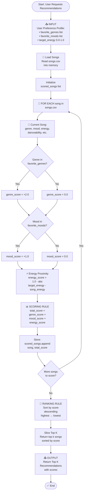

# 🎵 Music Recommender Simulation

## Project Summary

In this project you will build and explain a small music recommender system.

Your goal is to:

- Represent songs and a user "taste profile" as data
- Design a scoring rule that turns that data into recommendations
- Evaluate what your system gets right and wrong
- Reflect on how this mirrors real world AI recommenders

This version loads a 20-song CSV catalog, scores each song with a transparent
content-based rule, and returns the top K songs for a user profile. The scoring
prioritizes exact genre and mood matches, then fine-tunes rank by energy
closeness to the user's target_energy.

---

## How The System Works

This simulation uses **content-based filtering** — scoring each song against a 
user's taste profile based on shared attributes. No user history or crowd behavior 
is needed; recommendations are driven entirely by song attributes and stated preferences.

### How Real Systems Work
Platforms like Spotify use a hybrid of two approaches: **collaborative filtering** 
(recommending based on what similar users enjoy) and **content-based filtering** 
(matching songs to a user's taste using audio attributes). Our simulation focuses 
on content-based filtering, which avoids the cold-start problem and keeps every 
recommendation explainable.

### Song Features Used
Each `Song` is scored using the following attributes:
- `genre` — categorical (e.g. pop, lofi, rock, jazz)
- `mood` — categorical (e.g. happy, chill, intense, focused)
- `energy` — numerical, 0.0–1.0 (how active/intense the track feels)
- `tempo_bpm` — numerical, beats per minute
- `valence` — numerical, 0.0–1.0 (musical positivity)
- `danceability` — numerical, 0.0–1.0

### User Profile
Each `UserProfile` stores a taste profile dictionary with target_energy values for:
- `favorite_genre` — preferred genre (exact match)
- `favorite_mood` — preferred mood (exact match)
- `target_energy` — ideal energy level (0.0–1.0)

### Scoring Logic (Algorithm Recipe)
Each song is scored against the user profile as follows:
- **+2.0** for a genre match
- **+1.0** for a mood match
- **+0.0–1.0** for energy proximity (1.0 minus the absolute difference)

Songs are then ranked highest-to-lowest score and the top K results are returned.

### Potential Biases
- The dataset still leans toward a few repeated genres, so genre-heavy profiles
  may over-recommend those clusters.
- Genre is weighted highest, so a great mood/energy match with the wrong genre 
  will rank lower than a genre match with mismatched feel.

---

---

## Getting Started

### Setup

1. Create a virtual environment (optional but recommended):

   ```bash
   python -m venv .venv
   source .venv/bin/activate      # Mac or Linux
   .venv\Scripts\activate         # Windows

2. Install dependencies

```bash
pip install -r requirements.txt
```

3. Run the app:

```bash
python -m src.main
```

### Example Recommendation Output

Terminal output example showing recommended song title, artist, score, and reasons:


### Running Tests

Run the starter tests with:

```bash
pytest
```

You can add more tests in `tests/test_recommender.py`.

---

## Experiments You Tried

Use this section to document the experiments you ran. For example:

- What happened when you changed the weight on genre from 2.0 to 0.5
- What happened when you added tempo or valence to the score
- How did your system behave for different types of users

---

## Limitations and Risks

Summarize some limitations of your recommender.

Examples:

- It only works on a tiny catalog
- It does not understand lyrics or language
- It might over favor one genre or mood

You will go deeper on this in your model card.

---

## Reflection

Read and complete `model_card.md`:

[**Model Card**](model_card.md)

Write 1 to 2 paragraphs here about what you learned:

- about how recommenders turn data into predictions
- about where bias or unfairness could show up in systems like this


---

## 7. `model_card_template.md`

Combines reflection and model card framing from the Module 3 guidance. :contentReference[oaicite:2]{index=2}  

```markdown
# 🎧 Model Card - Music Recommender Simulation

## 1. Model Name

Give your recommender a name, for example:

> VibeFinder 1.0

---

## 2. Intended Use

- What is this system trying to do
- Who is it for

Example:

> This model suggests 3 to 5 songs from a small catalog based on a user's preferred genre, mood, and energy level. It is for classroom exploration only, not for real users.

---

## 3. How It Works (Short Explanation)

Describe your scoring logic in plain language.

- What features of each song does it consider
- What information about the user does it use
- How does it turn those into a number

Try to avoid code in this section, treat it like an explanation to a non programmer.

---

## 4. Data

Describe your dataset.

- How many songs are in `data/songs.csv`
- Did you add or remove any songs
- What kinds of genres or moods are represented
- Whose taste does this data mostly reflect

---

## 5. Strengths

Where does your recommender work well

You can think about:
- Situations where the top results "felt right"
- Particular user profiles it served well
- Simplicity or transparency benefits

---

## 6. Limitations and Bias

Where does your recommender struggle

Some prompts:
- Does it ignore some genres or moods
- Does it treat all users as if they have the same taste shape
- Is it biased toward high energy or one genre by default
- How could this be unfair if used in a real product

---

## 7. Evaluation

How did you check your system

Examples:
- You tried multiple user profiles and wrote down whether the results matched your expectations
- You compared your simulation to what a real app like Spotify or YouTube tends to recommend
- You wrote tests for your scoring logic

You do not need a numeric metric, but if you used one, explain what it measures.

---

## 8. Future Work

If you had more time, how would you improve this recommender

Examples:

- Add support for multiple users and "group vibe" recommendations
- Balance diversity of songs instead of always picking the closest match
- Use more features, like tempo ranges or lyric themes

---

## 9. Personal Reflection

A few sentences about what you learned:

- What surprised you about how your system behaved
- How did building this change how you think about real music recommenders
- Where do you think human judgment still matters, even if the model seems "smart"

