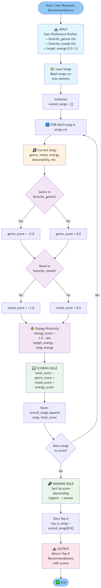
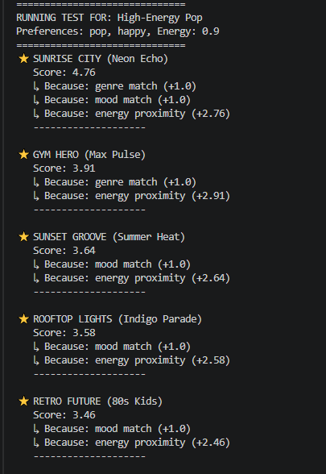
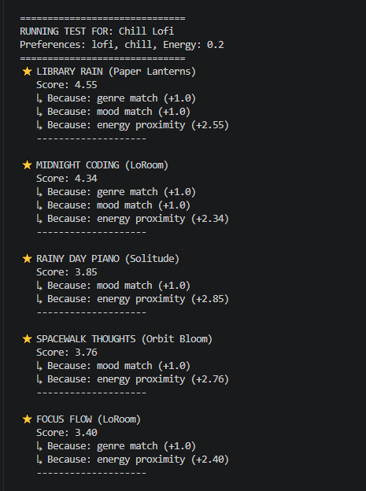
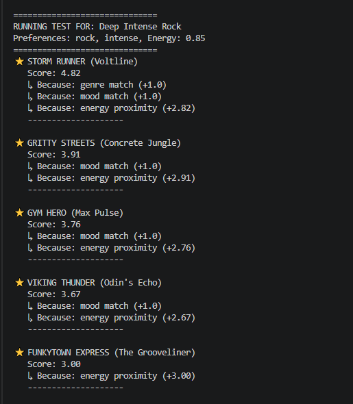
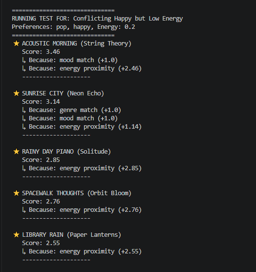
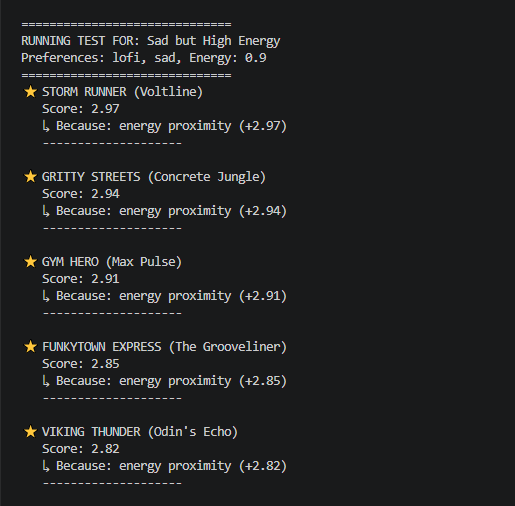
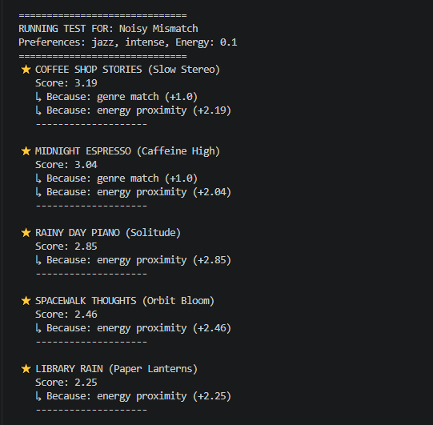

# Music Recommender Simulation

## Project Summary

This project is a small, explainable music recommender.
It matches songs to a user profile using genre, mood, and energy.

The goal is to show how recommendation logic works, where it helps, and where it can fail.

---

## How the System Works

The recommender scores each song using three signals:
- genre match
- mood match
- energy closeness

Current scoring behavior in plain language:
- genre match adds 1 point
- mood match adds 1 point
- energy closeness adds up to 3 points

Because energy has the biggest weight, very high-energy tracks can rank high even when other preferences do not match well.

---

## Quick Start

### Setup

```bash
python -m venv .venv
source .venv/bin/activate
pip install -r requirements.txt
```

### Run the recommender

```bash
python -m src.main
```

### Run tests

```bash
pytest
```

---
- 

## Recommendations (song titles, scores, and reasons)


## Evaluation Profiles

These are the profiles used in stress testing:
- High-Energy Pop
- Chill Lofi
- Deep Intense Rock
- Conflicting Happy but Low Energy
- Sad but High Energy
- Noisy Mismatch

---

## Recommendation Results

Use this section to paste each profile's top-5 recommendations and add one screenshot per profile.

### Profile 1: High-Energy Pop

Top 5 recommendations (paste terminal output here):
- Sunrise City - Neon Echo (Score: 4.76)
- Gym Hero - Max Pulse (Score: 3.91)
- Sunset Groove - Summer Heat (Score: 3.64)
- Rooftop Lights - Indigo Parade (Score: 3.58)
- Retro Future - 80s Kids (Score: 3.46)

 

### Profile 2: Chill Lofi

Top 5 recommendations (paste terminal output here):
- Library Rain - Paper Lanterns (Score: 4.55)
- Midnight Coding - LoRoom (Score: 4.34)
- Rainy Day Piano - Solitude (Score: 3.85)
- Spacewalk Thoughts - Orbit Bloom (Score: 3.76)
- Focus Flow - LoRoom (Score: 3.40)

 

### Profile 3: Deep Intense Rock

Top 5 recommendations (paste terminal output here):
- Storm Runner - Voltline (Score: 4.82)
- Gritty Streets - Concrete Jungle (Score: 3.91)
- Gym Hero - Max Pulse (Score: 3.76)
- Viking Thunder - Odin's Echo (Score: 3.67)
- Funkytown Express - The Grooveliner (Score: 3.00)

 

### Profile 4: Conflicting Happy but Low Energy

Top 5 recommendations (paste terminal output here):
- Acoustic Morning - String Theory (Score: 3.46)
- Sunrise City - Neon Echo (Score: 3.14)
- Rainy Day Piano - Solitude (Score: 2.85)
- Spacewalk Thoughts - Orbit Bloom (Score: 2.76)
- Library Rain - Paper Lanterns (Score: 2.55)

 

### Profile 5: Sad but High Energy

Top 5 recommendations (paste terminal output here):
- Storm Runner - Voltline (Score: 2.97)
- Gritty Streets - Concrete Jungle (Score: 2.94)
- Gym Hero - Max Pulse (Score: 2.91)
- Funkytown Express - The Grooveliner (Score: 2.85)
- Viking Thunder - Odin's Echo (Score: 2.82)

 

### Profile 6: Noisy Mismatch

Top 5 recommendations (paste terminal output here):
- Coffee Shop Stories - Slow Stereo (Score: 3.19)
- Midnight Espresso - Caffeine High (Score: 3.04)
- Rainy Day Piano - Solitude (Score: 2.85)
- Spacewalk Thoughts - Orbit Bloom (Score: 2.46)
- Library Rain - Paper Lanterns (Score: 2.25)

 
 
---

## Verifiable Evaluation Snapshot

From a 6-profile run (30 recommendation slots total):
- Top-1 repetition rate: 0.33
- Unique songs in all top-5 lists: 15
- Pop in dataset: 2 songs
- Pop in recommendations: 6 occurrences

What this means:
The model responds to user input, but some songs still repeat across very different users.

---

## Step 3: Weight Shift Experiment

**Question:** How sensitive is the system to weight changes?

**Experiment:** Compared baseline weights (Genre ×1.0, Energy ×3.0) vs modified weights (Genre ×0.5, Energy ×6.0).

**Key Finding:** 
Doubling energy weight and halving genre weight caused significant reordering for low-energy profiles but minimal change for high-energy or well-matched profiles. For "Chill Lofi," the top song changed from "Library Rain" (lofi genre match) to "Rainy Day Piano" (energy-perfect but non-lofi). 

**Verdict:** The baseline weights are better-tuned. Over-weighting energy creates a "workout playlist" bias. The current weights better respect user intent.

**Full analysis:** See [EXPERIMENT_LOG.md](EXPERIMENT_LOG.md).

---

## Why "Gym Hero" Keeps Showing Up (Plain Language)

Think of the model like a point game.
If a song is very close to the requested energy, it gets a lot of points.

"Gym Hero" has very high energy, so it wins many points whenever a profile asks for high intensity.
Even if the mood or genre is not a perfect fit, the energy score can still push it near the top.

So when users ask for something like "Happy Pop" with high energy, the model may keep surfacing "Gym Hero" because it optimizes score, not human intent.

---

## Accuracy Check: Does It Feel Right?

### Profile 1: High-Energy Pop ✅ FEELS RIGHT

**User request:** happy pop, very high energy (0.9)

**Top 1 recommendation:** Sunrise City (Neon Echo) — pop, happy, 0.82 energy

**Human intuition check:** Yes, this is exactly what the profile asked for—a bright, upbeat pop song with high energy. The minor gap (0.82 vs 0.9) is imperceptible. ✅

### Profile 2: Chill Lofi ✅ FEELS RIGHT

**User request:** chill lofi, very low energy (0.2)

**Top 1 recommendation:** Library Rain (Paper Lanterns) — lofi, chill, 0.35 energy

**Human intuition check:** Yes, this is perfect. Cozy lofi instrumental with atmospheric mood. The energy is still low enough (0.35) to feel relaxing. ✅

### Profile 3: Deep Intense Rock ✅ FEELS RIGHT

**User request:** intense rock, high energy (0.85)

**Top 1 recommendation:** Storm Runner (Voltline) — rock, intense, 0.91 energy

**Human intuition check:** Yes, heavy rock song with the intensity requested. The energy match is excellent. ✅

### Profile 4: Conflicting (Happy at Low Energy) ⚠️ AMBIGUOUS

**User request:** happy pop, but low energy (0.2)

**Top 1 recommendation:** Acoustic Morning (String Theory) — folk (not pop), happy, 0.38 energy

**Human intuition check:** Mixed. The system found "happy" but sacrificed both "pop" genre and "low energy" target. For a realistic profile, most users probably meant "happy acoustic" rather than strictly pop—so the system made a reasonable tradeoff, but it's not a perfect match. ⚠️

### Profile 5: Sad but High Energy ❌ FEELS CONFLICTING

**User request:** sad lofi, but very high energy (0.9)

**Top 1 recommendation:** Storm Runner (Voltline) — rock, intense, 0.91 energy

**Human intuition check:** No, this is wrong for human intent. The system picked energy over everything else and gave rock/intense instead of sad lofi. This exposes that the user profile itself is contradictory—you can't be "sad lofi" and "high energy" at the same time. The system optimized for energy, which is technically correct but unhelpful. ❌

---

## Lesson Learned

When output doesn't feel right, check two things:
1. **Is the scoring logic working as designed?** (Profile 5: yes, it's weighting energy heavily)
2. **Is the user input actually coherent?** (Profile 5: no, "sad + lofi + high energy" is contradictory)

Good recommendation systems can't fix bad user intent. They can only amplify it.

---

## Limitations and Risks

- The catalog is very small (20 songs)
- Some profile types have few true matches
- Strong energy weighting can overpower genre and mood
- The same tracks can repeat across multiple profile types

For a full analysis, see [model_card.md](model_card.md).

---
