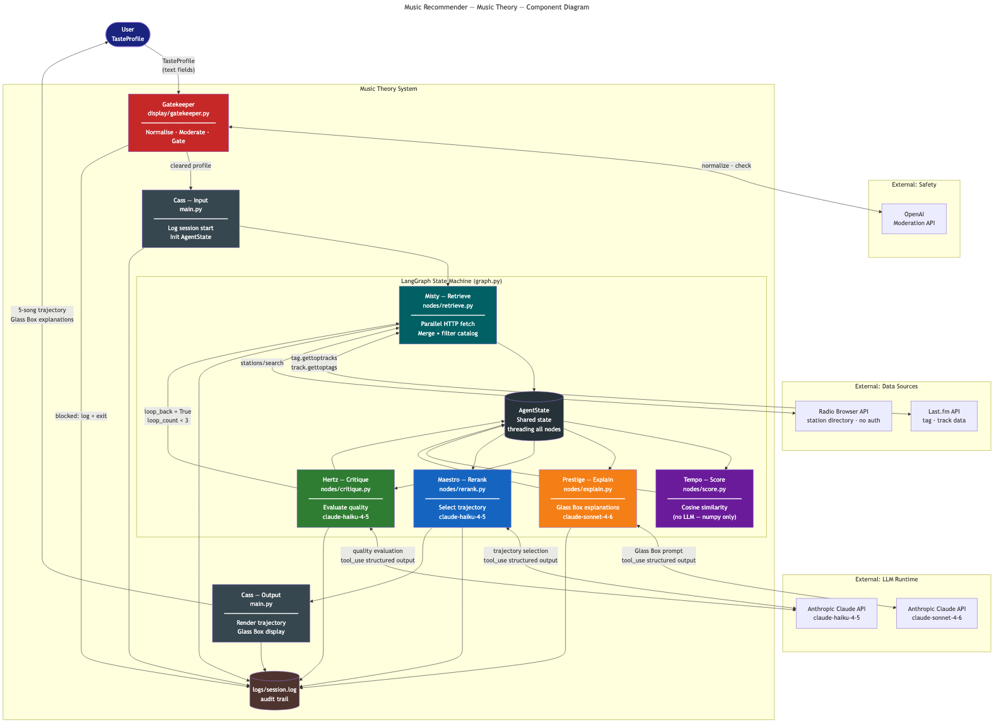
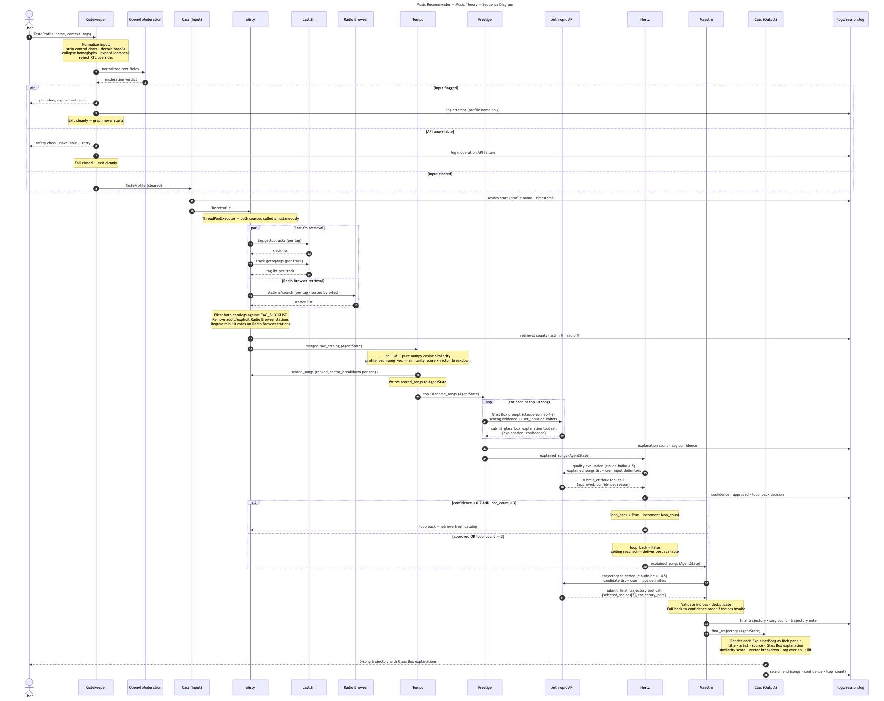
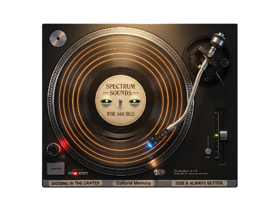

# Model Card — Music Recommender: Music Theory

This document describes not only what the system does, but what it cannot do, what it might do wrong, and what a production deployment would require to do it safely.

---

## 1. System Overview

**System name:** Music Recommender: Music Theory

**Type:** LangGraph-powered agentic recommendation system

**Purpose:** Accept a listener's four-dimensional audio preference vector and a set of genre or mood tags, retrieve live song data from three external sources, and return a prioritized, explained five-song trajectory where every recommendation cites its own reasoning evidence. When MasterMix mode is active, a fifth BPM dimension is added via the MeloData audio analysis API, and candidates are filtered to within ±5 BPM of the listener's target tempo.

**Primary interface:** Python CLI

**Model assignments:**

| Node | Character | Model |
| --- | --- | --- |
| Retrieve | Misty | No LLM — HTTP retrieval only (Last.fm, Radio Browser, MeloData) |
| Score | Tempo | No LLM — cosine similarity (numpy) |
| Explain | Prestige | claude-sonnet-4-6 |
| Critique | Hertz | claude-haiku-4-5 |
| Rerank | Maestro | claude-haiku-4-5 |

---

## 2. Base Project and Extension Scope

This system extends the Codepath AI110 Module 3 project: **Music Recommender Simulation**.

The original system operated on a static, hand-coded 20-song catalog. It matched listener profiles to songs using a weighted scoring function that awarded points for genre match, mood match, and energy proximity. That system was entirely deterministic — given the same profile, it always returned the same songs in the same order. It could not retrieve external data, could not explain its reasoning in natural language, and could not evaluate or improve its own output.

**Extensions introduced in Music Theory:**

- Static catalog replaced with live retrieval from Last.fm and Radio Browser; MeloData added as a third source for BPM enrichment and catalog discovery in MasterMix mode
- Weighted point scoring replaced with cosine similarity over a four-dimensional audio feature vector (energy, valence, danceability, acousticness); a fifth BPM dimension is added in MasterMix mode
- Natural language explanations generated via a constrained few-shot Glass Box prompt
- Self-evaluation loop added via the Hertz critique node with a bounded retry mechanism
- Input moderation added via Claude Haiku pre-flight (Gatekeeper node)
- Audit logging added via Python logging module

---

## 3. Architecture Overview

The component diagram shows the seven named agent components, their external API dependencies, and the shared AgentState that threads through all nodes. The Gatekeeper is not a graph node — it runs before the graph initializes and gates access to it.

The sequence diagram shows the runtime order of operations across a single session. The components that touch user data are: the Gatekeeper (receives raw text fields for normalization and moderation), Prestige (receives song titles, tags, and user context wrapped in `<user_input>` delimiters), Hertz (receives explanation text for quality evaluation), and Maestro (receives song metadata for trajectory selection). Safety checks occur at two points: the Gatekeeper pre-flight before the graph initializes, and the Hertz critique loop after explanation generation.

---

## 4. Threat Model

Eight threats were identified during design. Each has a defined mitigation.

**Threat 1: Multilingual hate speech**
Harmful content submitted in non-English languages including Arabic, Mandarin, and Spanish. Claude Haiku is used as the moderation model and supports multilingual input. Input normalization runs before the API call so content that bypasses normalization still reaches a model trained on multilingual harmful content. Independent verification of coverage for all languages was not performed — this is documented as a known limitation.

**Threat 2: Character substitution**
Leetspeak (`h4te`), special characters (`f*ck`), and symbol replacement (`@ss`) used to evade keyword filters. The Gatekeeper applies a translation table before moderation: `0→o`, `1→i`, `3→e`, `4→a`, `5→s`, `6→g`, `7→t`, `8→b`, `@→a`, `$→s`, `!→i`, `+→t`.

**Threat 3: Unicode homoglyphs**
Cyrillic or other script characters visually identical to Latin letters used to bypass keyword filters. The Gatekeeper applies NFKD Unicode normalization followed by ASCII encoding. Characters that cannot be mapped to ASCII are dropped before moderation.

**Threat 4: Invisible and zero-width characters**
Non-printable characters inserted to bypass filters or corrupt downstream processing. The Gatekeeper strips all Unicode category C (control) characters from text fields before any processing step.

**Threat 5: RTL override characters**
Unicode bidirectional control characters (U+202E and related) that reverse display direction, making harmful text appear safe in a terminal while the underlying bytes differ. The Gatekeeper detects these characters and rejects the input before making any API call.

**Threat 6: Prompt injection**
User-submitted context or tags containing instruction text designed to override LLM behavior. Four mitigations are applied simultaneously:

- All LLM nodes use structured JSON output via tool use. A model constrained to a JSON schema is significantly harder to hijack than a freeform text model.
- All user-supplied text passed to LLM nodes is wrapped in `<user_input>{value}</user_input>` delimiters. The system prompt labels this content as untrusted data, not instructions.
- Maximum input length is enforced at the Pydantic layer: context maximum 200 characters, each tag maximum 50 characters, preferred_tags maximum 10 items.
- Anomalous LLM behavior is logged to `logs/session.log` for audit.

**Threat 7: Base64 and encoded injection**
Payloads encoded in base64 to bypass text-level filters. The Gatekeeper attempts base64 detection and decoding before moderation using a regex pattern match against base64 token structure. Decoding is best-effort — tokens that decode to printable ASCII are substituted before the moderation call. This mitigation is not guaranteed to catch all encoding variants.

**Threat 8: ASCII art obscenity**
Characters arranged to form visual patterns that are harmful but technically clean text. No reliable mitigation exists. No current moderation system can reliably detect ASCII art obscenity, including general-purpose LLMs used as classifiers. This is a documented known limitation, not an implementation failure.

---

## 5. Content Policy

**What the system accepts:**

- TasteProfile with name up to 100 characters
- Four audio feature values between 0.0 and 1.0
- Between 1 and 10 genre or mood tags, each up to 50 characters
- Optional context string up to 200 characters
- Text in any language supported by Claude Haiku

**What the system rejects before reaching the graph:**

- Any text field flagged by Claude Haiku moderation
- Inputs containing RTL override characters
- Inputs where the moderation API is unavailable (fail closed)
- Inputs with empty preferred_tags (Pydantic validator)
- Inputs exceeding field length constraints (Pydantic validator)

**What the system filters from retrieved catalog data:**

- Songs whose Last.fm tags match any entry in the TAG_BLOCKLIST (hate speech, extremism, graphic violence)
- Radio Browser stations carrying any blocked tag
- Radio Browser stations tagged as adult, explicit, or age-restricted
- Radio Browser stations with fewer than 10 community votes

**Rejection behavior at each point:**

- Gatekeeper flag: Rich panel with plain-language refusal, log entry with profile name only (not content), clean exit
- Gatekeeper API failure: Rich panel noting service unavailable, log entry, clean exit — input never reaches graph
- Pydantic rejection: ValidationError with plain-language message, no API call made
- Catalog filter: song silently removed, count logged

---

## 6. Data Provenance

###  Last.fm

Last.fm is a music tracking and social cataloging platform. Tags on Last.fm are user-generated and unmoderated. Any registered user can apply any tag to any track. This means the tag corpus contains the full range of human expression — accurate genre labels alongside offensive, inaccurate, or spam tags.

Biases present in Last.fm data:

- Strong Western and English-language bias in both track coverage and tag vocabulary
- Mainstream artists have dense, accurate tag coverage; niche or regional artists have sparse or absent tags
- Tags reflect the tastes of the Last.fm user community, which skews toward listeners active in the mid-2000s to 2010s
- Popularity-ranked retrieval surfaces commercially successful tracks and may underrepresent independent or non-English music

Audio features in this system are estimated from tag semantics, not from audio analysis. A song tagged "ambient" is assigned a high acousticness estimate; a song tagged "metal" is assigned a high energy estimate. These estimates are intentionally coarse and are documented as heuristic, not authoritative.

###  Radio Browser

Radio Browser is a community-run directory of internet radio stations. It has no moderation infrastructure. Station names, tags, and descriptions are submitted by community members without review. Some stations broadcast adult content, extremist speech, or content not appropriate for general audiences.

Mitigations applied: tag blocklist filter, adult tag exclusion list, minimum 10-vote quality threshold.

Biases present in Radio Browser data:

- Coverage skews toward North American and European stations
- Stations in less-connected regions are underrepresented
- Station metadata quality is uneven — many stations have sparse or absent tag data
- Vote counts do not reflect content quality, only popularity within the Radio Browser community

### MeloData

MeloData is an audio intelligence API that provides high-accuracy BPM and audio feature data derived from real acoustic analysis (Essentia engine). It is the third catalog source, activated exclusively when the `--mastermix` flag is passed.

Unlike Last.fm and Radio Browser, MeloData does not supply a browsable music catalog that can be queried by genre tag. Instead, the system uses it in two complementary ways:

1. **BPM enrichment** — Last.fm tracks already in the catalog are cross-referenced by ISRC to resolve accurate BPM values, replacing the `None` default.
2. **Catalog discovery** — MeloData's `/v1/recommendations` endpoint is seeded with resolved ISRCs and the listener's target audio features to pull up to 20 additional tracks from MeloData's indexed catalog. These tracks arrive with BPM and full audio features already attached and are added to the catalog as `source="melodata"` entries alongside the Last.fm and Radio Browser candidates.

Biases present in MeloData data:

- Coverage skews toward commercially released and digitally distributed tracks that carry an ISRC. Underground, self-released, or regional recordings may not be indexed.
- Recommendation outputs reflect MeloData's internal similarity model, not the system's own cosine scoring. They enter the system as unranked candidates and are scored by Tempo on the same basis as all other tracks.
- Tracks returned from the recommendations endpoint may not match the listener's genre tags — BPM and energy proximity drive selection, not tag alignment.

### MasterMix BPM Reliability

The MasterMix feature adds a fifth BPM dimension to cosine scoring and a ±5 BPM proximity filter in Maestro's trajectory selection. Its reliability is contingent on the presence of BPM metadata in the catalog.

Neither Last.fm nor Radio Browser natively provides high-accuracy BPM. The `SongFeature.bpm` field is `None` for all tracks unless the MeloData enrichment step populates it.

**Three-phase BPM pipeline** (runs only when `--mastermix` is active):

**Phase 1 — ISRC enrichment:** Each Last.fm track's title and artist are searched against MeloData's index in parallel (up to 5 concurrent requests, respecting the free-tier rate limit). Featured-artist credits are stripped from titles before search to improve match rates. Resolved ISRCs are submitted in a single batch features call (up to 50 per batch) to retrieve BPM values. `SongFeature.bpm` is populated for any track with a match.

**Phase 2 — Artist seed fallback:** If Phase 1 resolves zero ISRCs — common when the catalog is dominated by tracks that are not in MeloData's index (e.g., regional artists, niche genres) — the system falls back to artist-name-only searches across all distinct Last.fm artists, stopping at the first successful ISRC resolution. This seed ISRC is used exclusively to unlock Phase 3; it does not enrich the originating track's BPM.

**Phase 3 — Catalog discovery:** If at least one seed ISRC was resolved in Phase 1 or 2, up to 20 MeloData recommendation tracks are fetched using those ISRCs as seeds, with the listener's `target_bpm`, `energy`, `danceability`, and `valence` as target features. Returned tracks are batch-fetched for full audio features (including `acousticness`, which the recommendations endpoint does not return inline) and added to the catalog as `source="melodata"` entries with `bpm` populated.

Radio Browser stations are always excluded from all three phases — they have no ISRC and are treated as BPM-neutral by the Maestro filter regardless of MasterMix mode.

**Behavior when `MELODATA_API_KEY` is absent:** BPM enrichment is silently skipped. Cosine scoring remains four-dimensional. The Maestro filter treats all candidates as neutral. The `--mastermix` flag is accepted and the session proceeds without BPM matching — no error is raised.

**Behavior when no seed ISRC can be resolved:** Phase 3 is skipped. The existing catalog is scored without BPM. A log message records the skip. The session continues normally.

**Quota management:** The MeloData free tier provides 1,000 lookups per month. Each search call and each batch features call counts against quota. Enrichment is gated behind `--mastermix` so quota is not spent on standard sessions. A catalog of 50 Last.fm tracks costs approximately 100–120 lookups per MasterMix session (50 search + 50 batch enrich + up to 20 recommendation feature lookups).

MeloData also provides energy, valence, and danceability from real audio analysis. A future enrichment step could optionally replace the current tag-based heuristic estimates for those dimensions, improving overall scoring accuracy. That change is out of scope for the current MasterMix implementation.

---

## 7. Guardrails Implementation

The following table maps current implementation components to their production-equivalent counterparts in AWS infrastructure.

| Current implementation | Production equivalent |
| --- | --- |
| Pydantic field constraints (max_length, ge, le) | AWS Bedrock Guardrails — input validation |
| `agent_log` list in AgentState | AWS CloudTrail — agent action audit log |
| `logs/session.log` (Python logging) | AWS CloudWatch Logs — structured log stream |
| Hertz critique node (LLM-based evaluation) | Bedrock automated evaluation — output quality assessment |
| Rich terminal output per node | AWS X-Ray traces — distributed tracing per node |
| Anthropic Claude Haiku (Gatekeeper moderation) | AWS Bedrock Guardrails content filters |
| TAG_BLOCKLIST in sources | AWS Comprehend — managed content classification |
| Tenacity retry decorator | AWS Step Functions retry logic |

### Glass Box Specialization — Prestige Prompt Documentation

Prestige uses a checklist-structured system prompt. The prompt enforces five Glass Box rules, a sentence limit, and an anti-patterns list that targets the specific failure modes caught by the Hertz critique node:

1. **Score first:** The first sentence must state the similarity score as a decimal number.
2. **Dimensions with threshold:** Name every dimension whose contribution exceeds 0.05 using its exact label (energy, valence, danceability, acousticness), with the contribution value in parentheses.
3. **Tag overlap — exact count and full list:** State the precise tag overlap count and list every overlapping tag by name. If there is no overlap, state that explicitly.
4. **Cultural context — dimension-linked:** Include one sentence naming a genre or artist tradition and connecting it to a specific dimension value from the scoring evidence.
5. **BPM (when provided):** If BPM data appears in the scoring evidence, state the value and note whether the track falls within the MasterMix window.

**Sentence limit:** 3 sentences. 4 maximum.

The prompt includes an explicit anti-patterns section listing the failure modes that cause the Hertz critique to reject explanations (score omitted, contribution values missing, tag names not listed, cultural context not linked to a dimension value). This reduces first-pass rejection rates and limits critique loop-backs.

The prompt includes an explicit baseline vs. Glass Box contrast to anchor the model's output away from generic recommendation language:

### Baseline (unconstrained)

> "You might enjoy this track because it matches your taste."

### Glass Box (constrained)

> "This track scores 0.94 similarity. Energy (0.31) and danceability (0.28) are its strongest contributors — both align with your high-energy, high-danceability profile. The tags 'afrobeats' and 'dance' overlap directly with your preferred tags. Afrobeats as a genre carries a long tradition of rhythmic complexity rooted in West African percussion, which may explain the strong danceability signal."

The measurable difference: the Glass Box output names specific dimensions, states a number, lists overlapping tags, and provides cultural context. The baseline output does none of these. This satisfies the Specialization stretch rubric requirement.

---

## 8. Failure Modes

### Last.fm timeout or unavailability

User-facing message: "Last.fm is currently unavailable. Recommendations based on Radio Browser only."

System behavior: continues with Radio Browser catalog only. If Radio Browser also fails, exits cleanly.

### Radio Browser timeout or unavailability

User-facing message: "Radio Browser is currently unavailable. Recommendations based on Last.fm only."

System behavior: continues with Last.fm catalog only.

### Both sources unavailable

User-facing message: "All data sources are currently unavailable. The system cannot generate recommendations. Please try again."

System behavior: exits cleanly with a non-zero exit code.

### Catalog too small after filtering

User-facing message: "Only N song(s) retrieved after filtering. The system requires at least 5 songs to produce a reliable trajectory. Try different tags or check that your API keys are valid."

System behavior: exits cleanly. Occurs when both sources return data but filtering removes most of it.

### Anthropic API timeout

User-facing message: "The reasoning engine timed out. The session has been logged. Please try again."

System behavior: logs to `logs/session.log`, exits cleanly.

### Anthropic API rate limit

User-facing message: "The reasoning engine is temporarily rate-limited. Retry in 60 seconds."

System behavior: logs to `logs/session.log`, exits cleanly.

### MeloData API unavailable or key absent (MasterMix mode)

User-facing message: None — the MeloData enrichment step fails silently and logs a warning.

System behavior: BPM fields remain `None` for all tracks. Cosine scoring runs in four dimensions. The Maestro BPM filter treats all candidates as neutral. The session produces a trajectory without BPM matching. A log entry notes the skip.

### MeloData returns no seed ISRC (Phase 2 exhausted)

User-facing message: None — logged at INFO level.

System behavior: Phase 3 (catalog discovery) is skipped. The catalog contains only Last.fm and Radio Browser tracks. BPM values for any tracks successfully enriched in Phase 1 remain populated. The session continues normally. This occurs most frequently when the genre tags yield tracks not indexed in MeloData (e.g., regional or niche artists).

### Anthropic API unavailable (Gatekeeper moderation call)

User-facing message: "Input safety verification is currently unavailable. The system cannot process this request. Please try again."

System behavior: fails closed. Input never reaches the graph. Logs the failure.

---

## 9. Known Limitations

### MeloData catalog coverage gap

MeloData's index skews toward commercially released tracks with ISRCs. Genre profiles built around regional, underground, or niche music (e.g., Afrobeats artists not distributed through major international channels) may yield zero ISRC matches in Phase 1, triggering the artist-seed fallback. If the fallback also fails, Phase 3 catalog discovery is skipped entirely. In these cases, MasterMix mode still applies the ±5 BPM filter in Maestro but has no BPM-tagged candidates to filter — the filter becomes a no-op. The trajectory is produced from Last.fm and Radio Browser tracks only, with `bpm=None` for all entries.

### Filter bubble risk

Cosine similarity rewards proximity. A profile with strong preferences will consistently surface songs close to those preferences. The system has no mechanism for serendipitous discovery or deliberate diversity injection beyond Maestro's source diversity criterion. Repeated sessions with the same profile will return similar results.

### Cold start

The system has no user history. Every session begins from the submitted TasteProfile with no prior context. The profile is the entire signal. Users who cannot accurately self-report their audio preferences in four dimensions will receive less relevant recommendations.

### Tag quality variance

Last.fm tags are user-generated and highly variable in quality. The same genre may be described by dozens of different tag strings across the corpus. Audio feature estimates derived from tags inherit this variance — two songs with identical audio profiles may receive different feature estimates if their tag sets differ.

### Radio Browser coverage gaps

Radio Browser has uneven global coverage. Stations from North America and Western Europe are well-represented; stations from other regions are sparse. A listener whose taste is rooted in regional music outside these areas will receive fewer Radio Browser results.

### ASCII art obscenity not detectable

As documented in the threat model, no current moderation system can reliably detect ASCII art obscenity. This is a known gap in the Gatekeeper's coverage.

### Moderation language coverage not independently verified

Claude Haiku supports multilingual input. Coverage has not been independently verified for all languages. For low-resource languages, detection accuracy may be lower than for high-resource languages.

### Confidence scores measure internal consistency, not ground truth

The confidence values produced by Prestige and evaluated by Hertz reflect whether the explanation is internally consistent with the scoring evidence. They do not measure whether the recommendation is actually good for the listener. A high confidence score means the system is confident in its own reasoning, not that the song is a correct match.

---

## 10. What This System Cannot Do — And Should Never Claim To

- **Cannot verify cultural appropriateness for a specific listener.** A song may be tagged with a genre that has cultural significance the listener finds inappropriate. The system has no mechanism to detect or account for this.

- **Cannot verify that a Radio Browser station is currently broadcasting safe content in real time.** Station filtering occurs at retrieval time based on metadata tags. A station may broadcast harmful content not reflected in its tags. The system streams URLs, not content.

- **Cannot detect hate speech in audio.** All moderation operates on text fields only. Audio content from streamed stations is not analyzed.

- **Cannot account for a listener's personal history with a song or artist.** A song that scores highly on cosine similarity may be one the listener has heard thousands of times, associates with a painful memory, or actively dislikes for reasons outside the four-dimensional feature space.

- **Cannot guarantee Last.fm tags reflect actual song content.** Tags are applied by users, not by the artists or any verified source. A tag may be ironic, incorrect, or applied as spam.

- **Confidence scores are not ground truth.** They are the system's internal assessment of its own reasoning quality. They should not be presented to a listener as a measure of recommendation accuracy.

---

## 11. Production Readiness Gap

This implementation is a demonstration system. The following gaps exist between current state and production deployment:

**Authentication and authorization:** No user authentication exists. A production deployment would require identity management, session isolation, and per-user rate limiting.

**Persistent user state:** The system processes one profile per session with no memory between sessions. A production system would store anonymized interaction data to enable personalization over time.

**Catalog caching:** Every session makes live API calls to Last.fm and Radio Browser. A production system would cache tag-to-song mappings with a defined TTL to reduce latency and API costs.

**Scalability:** The system is single-threaded at the session level. Concurrent users would require a queueing mechanism and horizontal scaling.

**Moderation coverage:** The current blocklist is maintained manually. A production system would integrate a managed content classification service and maintain the blocklist through a defined update process.

**Monitoring and alerting:** The current audit trail is a flat log file. A production system would require structured logging, dashboards for recommendation quality metrics, and alerting on anomalous patterns.

**Model version pinning:** The current implementation uses named model constants (`claude-haiku-4-5`, `claude-sonnet-4-6`). A production deployment would pin to specific model versions and implement a rollout process for model updates.

**Legal and compliance review:** No legal review of the data provenance, user data handling, or recommendation liability has been performed. A production deployment would require review appropriate to the deployment jurisdiction.

---

## 12. AI Collaboration Reflection

Claude Code (claude-sonnet-4-6) was used as the primary development tool throughout this project. The following instances illustrate both the value and the limits of AI-assisted engineering.

**One instance where AI assistance was helpful:**

The Gatekeeper threat model was substantially stronger than the initial design. The initial specification called for basic OpenAI Moderation API integration. During implementation, the AI expanded the threat model to include RTL override characters, Unicode homoglyphs, zero-width character injection, and base64 encoding attacks — threats that were not in the original specification but are well-documented in the security literature on LLM input handling. Each mitigation was implemented in the normalization pipeline before the moderation API call, creating a defense-in-depth posture that a single-layer implementation would not have achieved.

**One instance where AI assistance produced a flawed suggestion:**

During the design of the `_estimate_features` function in `sources/lastfm.py`, the AI proposed a tag-to-feature heuristic that mapped genre tags to audio feature estimates using fixed scalar values. The function works correctly for common genres but produces identical feature vectors for any two songs sharing the same dominant tag — a "metal" song and a different "metal" song both receive `energy=0.9` regardless of their actual audio characteristics. This is documented in the function's docstring as intentionally coarse, but the underlying limitation — that tag-based estimation cannot produce the granularity of actual audio analysis — was not surfaced prominently enough in the initial implementation. A production system would replace this with actual audio feature retrieval from a source like the Spotify Audio Features API.

---

## 13. Incident Response (Conceptual)

If a harmful output were detected post-delivery in a production deployment of this system, the following response sequence would apply:

**Detection:** A harmful recommendation is identified, either by an automated quality monitor, a user report, or internal audit of the session log.

**Immediate containment:** The session log entry for the affected session is retrieved. The `agent_log` field in AgentState records every node firing with timestamps. This allows reconstruction of the exact catalog items that entered the pipeline, the scoring evidence that elevated the harmful item, and the explanation text that was generated. The session is isolated.

**Root cause analysis:** The source of the harmful item is identified — Last.fm or Radio Browser. The specific tag or metadata that allowed the item to pass the content filter is identified. If the item bypassed the TAG_BLOCKLIST, the blocklist is updated. If the item bypassed the adult tag filter, the filter is updated.

**Scope assessment:** The session log is queried to determine whether the same item appeared in other sessions. All affected sessions are identified.

**Remediation:** Affected users are notified. The harmful item is added to the blocklist. The retrieval source is queried to determine whether the item's metadata has been updated. If not, a direct exclusion rule is added.

**Post-incident review:** The threat model is reviewed to determine whether the incident represents a category of attack not currently covered. If so, a new mitigation is designed, implemented, and documented.

**Documentation:** The incident is documented with the root cause, the gap it exposed, the remediation applied, and the timeline from detection to resolution. This documentation is retained for future audits.

---

## 14. What This Project Says About Me as an AI Engineer

This project shows that I build systems that are honest about what they do. The interesting decisions weren't about adding more AI — they were about knowing what each agent should and should not do.

<table>
  <tr>
    <td colspan="3" align="center" valign="bottom"> <b>Base</b></td>
  </tr>
  <tr>
    <td align="center" valign="bottom"> <b>Cass</b></td>
    <td align="center" valign="bottom"> <b>Misty</b></td>
    <td align="center" valign="bottom"> <b>Tempo</b></td>
  </tr>
  <tr>
    <td align="center" valign="bottom"> <b>Prestige</b></td>
    <td align="center" valign="bottom"> <b>Hertz</b></td>
    <td align="center" valign="bottom"> <b>Maestro</b></td>
  </tr>
</table>

| Agent | Role | Design Decision |
|---|---|---|
| Misty | Retrieve | Calls Last.fm and Radio Browser simultaneously — never one at a time |
| Tempo | Score | Uses cosine similarity, not a language model — math has a correct answer |
| Prestige | Explain | Every explanation names the score, the dimensions, and the evidence |
| Hertz | Critique | Nothing passes that it isn't confident in — loops back if quality is low |
| Maestro | Rank | Arranges a trajectory, not just a sorted list |
| Base | Narrator | Opens and closes every session — the system has a beginning and an end |
| Cass | Input + Output | First thing the listener sees, last thing they see |

A system that hides what it can't do isn't trustworthy. I documented the limitations, the threat model, and the failure modes not because I had to — because that's the kind of engineer I'm trying to be.
